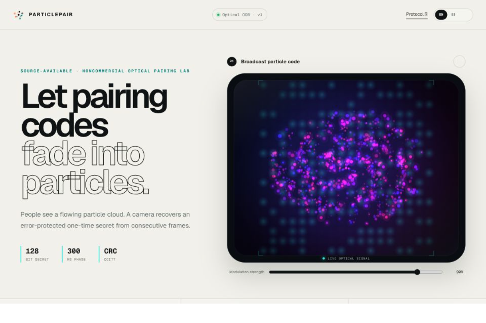

<div align="center">
  
  <h1>ParticlePair</h1>
  <p><strong>Emparejamiento oculto en movimiento.</strong><br /><sub>Un proyecto de OrbitaCero.</sub></p>
  <p>Una galaxia giratoria y luminosa para las personas. Una trama óptica verificable para las cámaras.</p>

  <p>
    <a href="./README.md"></a>
    <a href="./README.es.md"></a>
    <a href="./README.zh-CN.md"></a>
  </p>

  <p>
    
    <a href="https://github.com/tianrking/ParticlePair/actions/workflows/ci.yml"></a>
    <a href="#limitaciones-conocidas"></a>
    <a href="./LICENSE"></a>
    <a href="./LICENSE"></a>
    <a href="./COMMERCIAL-LICENSE.md"></a>
  </p>

  <p>
    <a href="https://vercel.com/new/clone?repository-url=https%3A%2F%2Fgithub.com%2Ftianrking%2FParticlePair&amp;project-name=particle-pair&amp;repository-name=particle-pair"></a>
  </p>
</div>



> [!IMPORTANT]
> ParticlePair es un proyecto de **código disponible**, no software de código abierto según la definición de la OSI. No se concede automáticamente ningún derecho comercial. Los productos comerciales, servicios de pago, SDK, hardware, operaciones comerciales internas y cualquier otro uso comercial requieren la autorización escrita y expresa del titular de los derechos o una licencia comercial firmada por separado **antes de su uso**.

## Descripción general

ParticlePair codifica un secreto de emparejamiento de 128 bits y un solo uso dentro de una galaxia luminosa de partículas con tres brazos. La capa visual utiliza partículas saturadas en azul, violeta y magenta, mientras que una portadora cian con fuerte componente verde proporciona a la cámara un canal óptico separable. El receptor compara fases de modulación opuestas, extrae una cuadrícula legible por máquina, corrige una cantidad limitada de errores de bits y solo libera el secreto después de validar su integridad.

La imagen busca transmitir una sensación ambiental a las personas sin dejar de ser estructuralmente decodificable por software. El proyecto es un prototipo de investigación diseñado de forma independiente; no implementa el emparejamiento de Apple Watch, no es compatible con él ni está afiliado con Apple.

**Navegación:** [Tecnología](#pila-tecnológica) · [Cómo funciona](#cómo-funciona) · [Inicio rápido](#inicio-rápido) · [Escaneo por cámara](#escaneo-con-dos-dispositivos) · [Protocolo](#particle-code-v1) · [Seguridad](#modelo-de-seguridad) · [Licencia comercial](#licencia-y-uso-comercial)

## Pila tecnológica

<table>
  <tr>
    <td align="center" width="33%">
      <br />
      <br />
      <sub><strong>Entorno web</strong><br />App Router · SSR · interfaz adaptable</sub>
    </td>
    <td align="center" width="33%">
      <br />
      <br />
      <sub><strong>Lenguaje y compilación</strong><br />Tipos estrictos · Vinext · doble cadena</sub>
    </td>
    <td align="center" width="33%">
      <br />
      <br />
      <sub><strong>Entorno óptico</strong><br />Galaxia animada · muestreo de vídeo</sub>
    </td>
  </tr>
  <tr>
    <td align="center">
      <br />
      <br />
      <sub><strong>Material secreto</strong><br />Generado en cliente · nunca renderizado por servidor</sub>
    </td>
    <td align="center">
      <br />
      <br />
      <sub><strong>Trama e integridad</strong><br />Particle Code v1 · liberación protegida</sub>
    </td>
    <td align="center">
      <br />
      <br />
      <sub><strong>Despliegue</strong><br />Next.js nativo · Worker/Sites</sub>
    </td>
  </tr>
</table>

| Capa | Implementación actual |
| --- | --- |
| Material de emparejamiento | Secreto de 128 bits y un solo uso generado por el navegador |
| Paquete | 21 bytes, incluida la cabecera y CRC-16 |
| Corrección de errores | Hamming(12,8), un bit corregible por palabra de código |
| Disposición óptica | 252 bits codificados en una cuadrícula de 18×18 |
| Modulación | Fases opuestas de una portadora cian con fuerte componente verde, 300 ms por fase |
| Renderizado | Canvas 2D, galaxia animada de tres brazos y 1.050 partículas |
| Receptor | `getUserMedia()`, diferencia de fotogramas en canal verde y correlación de sincronía |
| Despliegue | Cloudflare Worker/Sites y Next.js nativo en Vercel |

## Aviso importante

- Este repositorio no ha recibido una auditoría criptográfica, de seguridad de hardware ni de seguridad independiente para producción.
- Las pruebas automatizadas cubren el empaquetado, la corrección, el rechazo por CRC, el renderizado y ambas compilaciones de despliegue. No demuestran la fiabilidad del enlace físico en una matriz amplia de dispositivos.
- El escáner busca escalas y desplazamientos próximos, recupera entradas rotadas o reflejadas y aplica candidatos de homografía acotados para distorsiones trapezoidales comunes. Aún depende de la alineación guiada y no infiere esquinas arbitrarias ni calibra el dispositivo automáticamente.
- El uso se limita a lo permitido por la [PolyForm Noncommercial License 1.0.0](./LICENSE). Consulta la [información de licencia comercial](./COMMERCIAL-LICENSE.md) para cualquier otro uso.

## Cómo funciona

```text
secreto de 128 bits y un solo uso
          │
          ▼  trama de protocolo + CRC-16
          │
          ▼  corrección Hamming(12,8)
          │
          ▼  252 bits asignados a una cuadrícula de 18×18
          │
          ▼  fases cian opuestas dentro de una galaxia luminosa
          │
          ▼  diferencia de fotogramas del canal verde
          │
          └─ sincronizar → decodificar → corregir → validar CRC → liberar secreto
```

Una persona ve 1.050 partículas saturadas girando en tres brazos espirales, respirando, agrupándose y dispersándose. La galaxia azul, violeta y magenta se separa de forma deliberada de la portadora óptica cian con fuerte componente verde. El receptor resta dos fotogramas de fases opuestas del canal verde para suprimir la escena decorativa y gran parte de las variaciones globales de exposición. Un patrón exterior asimétrico identifica el signo diferencial; las celdas interiores transportan los datos codificados.

## Funciones

- Generar o introducir un secreto de 16 bytes/128 bits y un solo uso.
- Cambiar toda la interfaz entre inglés, español y chino simplificado, guardando la elección localmente.
- Codificar un paquete Particle Code v1 de 21 bytes.
- Validar la integridad mediante CRC-16/CCITT-FALSE.
- Corregir un bit en cada palabra de código Hamming(12,8).
- Renderizar una cuadrícula óptica de 18×18 detrás de una galaxia Canvas 2D luminosa de tres brazos y 1.050 partículas.
- Separar la galaxia visual roja/azul de la portadora cian con fuerte componente verde utilizada por la cámara.
- Decodificar desde la cámara del navegador mediante emparejamiento temporal de fotogramas, búsqueda de recortes a varias escalas, recuperación de rotación/reflejo, acumulación de evidencia suave, cancelación de deriva de exposición y correlación de sincronía.
- Renderizar PNG deterministas de fases opuestas para una prueba de bucle con píxeles Canvas independiente de la plataforma.
- Ejecutar una prueba de bucle local con errores inyectados en palabras de código independientes.
- Compilar tanto para Cloudflare Worker/Sites como para Next.js nativo en Vercel.

## Inicio rápido

### Requisitos

- Node.js 22.13 o posterior
- npm
- Un navegador moderno compatible con Canvas, Web Crypto y `getUserMedia()`

### Compatibilidad de navegadores

- El emisor funciona en versiones actuales de Chrome, Edge, Firefox y Safari, tanto en escritorio como en móvil, siempre que estén disponibles Canvas 2D y Web Crypto.
- El receptor de cámara requiere además un contexto HTTPS seguro y permiso para `getUserMedia()`. Chrome y Safari en iPhone, Chrome en Android y los navegadores actuales de escritorio se adaptan mediante detección de funciones, no por el nombre del navegador.
- El escáner usa `requestVideoFrameCallback()` cuando está disponible y vuelve automáticamente a `requestAnimationFrame()` cuando no lo está.
- Usa la aplicación completa del navegador, no un navegador integrado dentro de otra aplicación, y mantén la pestaña en primer plano durante el escaneo.

```bash
git clone https://github.com/tianrking/ParticlePair.git
cd ParticlePair
npm ci
npm run dev
```

Abre la dirección local que aparece en la terminal.

### Prueba de bucle local

1. Selecciona **Generar nuevo secreto**.
2. Selecciona **Autoprueba de bucle**.
3. La prueba invierte tres bits en tres palabras de código Hamming independientes.
4. El decodificador debe corregirlos, superar la validación CRC y reproducir el secreto original.

## Acceso por LAN

Expón el servidor de desarrollo a dispositivos de la misma red local de confianza:

```bash
npm run dev:lan
```

Abre desde otro dispositivo la dirección de red mostrada, normalmente:

```text
http://<IP-LAN-del-ordenador>:3000
```

- Mantén ambos dispositivos en la misma red Wi-Fi/LAN.
- En Windows, permite Node.js a través del cortafuegos solo para **redes privadas** cuando se solicite.
- Una red Wi-Fi para invitados o el aislamiento de clientes del punto de acceso puede impedir la comunicación entre dispositivos.
- No expongas directamente el servidor de desarrollo a Internet.

> [!WARNING]
> HTTP sin cifrar dentro de la LAN basta para navegar, generar y **mostrar** el código de partículas. El escaneo por cámara usa `getUserMedia()` y los navegadores normalmente exigen HTTPS o `localhost`. Para completar un escaneo entre dos dispositivos, abre el receptor desde un despliegue HTTPS como Vercel o coloca el servidor LAN detrás de TLS confiable para el dispositivo receptor.

## Despliegue

### Vercel con un clic

[](https://vercel.com/new/clone?repository-url=https%3A%2F%2Fgithub.com%2Ftianrking%2FParticlePair&project-name=particle-pair&repository-name=particle-pair)

No se necesitan variables de entorno, bases de datos ni almacenamiento de objetos. [`vercel.json`](./vercel.json) selecciona la compilación nativa de Next.js y mantiene intacta la ruta existente de Vinext/Cloudflare.

El despliegue sigue sujeto a la licencia del repositorio y **no** concede permiso de uso comercial.

## Escaneo con dos dispositivos

1. Abre ParticlePair en el emisor y mantén visible toda la nube de partículas.
2. Genera un secreto y conserva la intensidad de modulación alrededor del 90% o más.
3. Abre un despliegue HTTPS de ParticlePair en el dispositivo receptor con cámara.
4. Selecciona **Iniciar escáner de cámara** y concede permiso para usar la cámara.
5. Alinea las cuatro esquinas ópticas cian del emisor con la guía cuadrada del receptor. El marco rectangular exterior no forma parte del código.
6. Mantén estables la distancia, el ángulo y la exposición mientras terminan la sincronización y la validación CRC.

`SYNC` representa evidencia calibrada por encima del nivel de correlación aleatoria; no es un medidor genérico de actividad de la cámara. Las escenas no relacionadas deberían permanecer cerca de 0%; los valores superiores al 30% se tratan como candidatos de sincronía y los valores iguales o superiores al 47% pueden entrar en la decodificación multifotograma. La interfaz solo informa de éxito cuando el paquete también supera la decodificación Hamming y la validación CRC-16.

El receptor comienza con 61 geometrías de recorte y perspectiva. Un controlador con histéresis reduce la búsqueda a 45 geometrías tras cinco observaciones estables y a 25 después de mantener calidad de decodificación. Una caída de calidad amplía la búsqueda en una o dos observaciones. Cada cambio de nivel invalida el historial incompatible; la interfaz solo muestra el nivel, el número de geometrías y el tiempo de muestreo local, nunca el contenido transmitido.

El RGB de la cámara se proyecta en un canal oponente cian que conserva amplitud, `G - 0.42R - 0.16B`, para rechazar el arte azul, violeta y magenta sin eliminar el pulso óptico. En cada par de fases, la separación claro/oscuro del borde conocido estima la ganancia multiplicativa de exposición automática; después se eliminan esa ganancia y el desplazamiento aditivo de negro antes de sincronizar, corregir con Hamming y validar el CRC. El valor `AE ×` hace visible la compensación en tiempo real.

Cada candidato de perspectiva incluye además un registro de rango dinámico. Un punto solo se considera saturado cuando al menos dos canales RGB alcanzan el límite del sensor, evitando falsas alarmas por el portador cian deliberadamente verde. El rango percentil 10–90 del canal oponente distingue señal útil de una imagen plana y la proporción de sombras en los tres canales detecta subexposición. `DR` muestra la salud combinada; con sincronía débil, el receptor convierte estas pruebas en indicaciones concretas sobre brillo, distancia o contraluz en lugar de mostrar ruido genérico.

El borde alterno de sincronía también funciona como carta de enfoque integrada. Su separación claro/oscuro en el canal oponente se normaliza por el rango percentil 10–90 de toda la imagen, de modo que los bordes intensos de la nebulosa interior no pueden fingir nitidez. `F` muestra esta modulación; si el rango dinámico es sano pero `F` es bajo, el receptor recomienda tocar para enfocar o aumentar un poco la distancia.

El emparejamiento de fases usa un modelo móvil de 15 intervalos en lugar de una tolerancia fija. La mediana estima los FPS reales y la desviación absoluta mediana mide el jitter sin dejar que una pausa aislada domine. La ventana se reduce a 72 ms en cámaras rápidas y estables y solo se amplía hasta 145 ms con captura lenta o irregular, manteniendo separables las fases. `J` muestra el jitter en milisegundos; una cadencia inestable genera una indicación específica para mantener la página visible y desactivar el ahorro de batería.

El tiempo mostrado ahora incluye muestreo geométrico, salud RGB, ocho transformaciones de orientación, ajuste de exposición y ranking de candidatos, no solo la lectura del Canvas. El controlador entra en enfriamiento tras cuatro fotogramas consecutivos fuera de presupuesto y procesa callbacks alternos, mientras el estimador temporal sigue observándolos todos. Ocho observaciones sostenidas de baja carga restauran la frecuencia completa. `L` informa utilización corregida por ciclo de trabajo para representar la presión media real de CPU.

La liberación también exige consenso temporal de orientación. El receptor mantiene una ventana de ocho ganadores sobre las ocho rotaciones y reflejos; las claves de recorte próximas pueden cambiar con el movimiento de la mano, pero una transformación debe conservar al menos dos tercios de los votos y superar la comprobación de margen frente a la segunda opción. Se requieren tres observaciones para bloquear y dos fotogramas de evidencia suave del mismo candidato antes de decodificar; perder señal borra los votos. `C` muestra la fuerza del consenso y el magenta indica ambigüedad que bloquea la liberación antes de Hamming y CRC.

La cámara usa una máquina de estados explícita: inactiva, activa, suspendida o finalizada. Ocultar la página o recibir un mute temporal suspende los callbacks y borra historial de fase, evidencia suave, votos de orientación, modelos temporales/de carga y sesiones Fountain parciales. Solo se reanuda si la página está visible y la misma pista sigue live y sin mute, siempre con sincronización nueva. Una pista ended nunca se reutiliza y la interfaz solicita reiniciar el escáner; un fallo de inicio también detiene todas las pistas adquiridas.

La frecuencia de actualización de la pantalla, PWM, el obturador rodante, la exposición automática y la limitación de tareas en segundo plano del navegador pueden afectar al enlace óptico. Es un prototipo de investigación funcional, no una promesa de interoperabilidad sin calibración.

## Particle Code v1

ParticlePair es el nombre del proyecto. **Particle Code v1** es su protocolo actual de trama óptica.

### Paquete

```text
paquete de 21 bytes
├── magic           1 byte   0xA7
├── versión         1 byte   0x01
├── longitud        1 byte   0x10
├── secreto        16 bytes
└── CRC-16          2 bytes

21 bytes × Hamming(12,8) = 252 bits ópticos
```

### Disposición óptica

- Cuadrícula total: 18×18, 324 celdas.
- Borde exterior: 68 celdas de fase y sincronización de trama.
- Área interior: 16×16, 256 celdas.
- Datos codificados: 252 celdas.
- Celdas restantes: cuatro bits de relleno determinista.

El borde asimétrico permite que el receptor deduzca el signo de la fase diferencial y busque las cuatro rotaciones y la entrada reflejada.

### Capacidad de corrección

Cada byte original se codifica de forma independiente como una palabra Hamming(12,8). La implementación puede reparar un bit invertido por palabra de código. CRC-16 detecta y rechaza discrepancias de suma de comprobación después de la decodificación, pero no garantiza detectar cualquier alteración ni es un autenticador criptográfico.

## Estudio óptico generativo

ParticlePair separa la portadora óptica fiable de la capa artística generativa. Los 50 estilos comparten la misma portadora diferencial calibrada de 18×18, por lo que cambiar el aspecto no exige otro decodificador de cámara.

- 50 modos en cinco colecciones: Cosmic, Organic, Geometric, Atmospheric y Synthetic.
- 13 familias de renderizado: galaxias, cortinas, anillos, pétalos, órbitas, nodos, tentáculos, nubes, tejidos, facetas, glifos, ciudades y brasas.
- Búsqueda, filtros, espectro propio por modo, presentación automática, selección persistente y escenario inmersivo.
- Cada modo explica su algoritmo generativo, extracción de cámara y estrategia de robustez.
- Visual Quality Engine mide viveza, contraste, cobertura cromática, continuidad de movimiento y nota compuesta sobre píxeles reales. Ninguno de los 50 modos actuales queda por debajo de 55.
- Camera Channel Lab prueba señal limpia, poca luz, deriva de exposición, desenfoque, ruido de sensor y oclusión parcial. Solo aprueba si el secreto coincide y pasa CRC.
- La modulación adaptativa busca la intensidad mínima que supera los canales limpio y con deriva, y añade ocho puntos de margen.

La decoración no posee bits del protocolo. La atmósfera espectral estática se cancela entre fases opuestas y los detalles móviles permanecen dispersos para que Hamming y la evidencia temporal absorban el error residual.

## Particle Code v2: flujo fountain óptico

V2 conserva exactamente 21 bytes y 252 bits ópticos. Divide el secreto de 128 bits en cuatro bloques de 4 bytes. Cada fragmento transporta una ecuación XOR elegida entre 15 máscaras sistemáticas y de paridad. El receptor aplica eliminación gaussiana en GF(2): cuatro ecuaciones linealmente independientes recuperan el secreto sin importar el orden; los duplicados no aumentan el rango.

| Bytes | Significado |
|---|---|
| 0–1 | Magic y versión |
| 2–5 | ID de sesión de 32 bits |
| 6–9 | Minuto de emisión |
| 10–12 | Secuencia, máscara de cuatro bits y longitud |
| 13–16 | Carga XOR de cuatro bytes |
| 17–18 | Número de bloques y longitud del secreto |
| 19–20 | CRC-16/CCITT-FALSE |

Cada byte conserva Hamming(12,8). Las sesiones caducan a los diez minutos y rotan a los ocho. Se rechazan repeticiones completadas, ecuaciones conflictivas, fragmentos futuros o caducados y CRC inválido. El receptor limita el estado a ocho sesiones incompletas y 32 registros antirrepetición.

Perfiles temporales, todos múltiplos de la fase de 300 ms:

- Fast: 600 ms por ecuación.
- Balanced: 900 ms por ecuación, perfil predeterminado.
- Robust: 1200 ms por ecuación para baja tasa de cuadros, distancia o iluminación difícil.

La matriz en vivo muestra bloques activos, máscara XOR, posición, TTL y rango requerido. Canvas Proof recorre renderizado, muestreo bifásico, Hamming, CRC y recuperación fountain.

## Modelo de seguridad

Tras la recuperación óptica, ambos dispositivos derivan de forma independiente un Short Authentication String de 18 bits mediante SHA-256 sobre un separador de dominio, el secreto y el ID de sesión v2. El usuario debe comparar tres palabras y una huella hexadecimal de seis dígitos antes de aceptar el par. SAS solo detecta sustituciones si una persona compara realmente ambas pantallas; no sustituye un intercambio de claves autenticado.

| Límite | Estado actual |
| --- | --- |
| Material secreto | 128 bits aleatorios generados con Web Crypto en el navegador |
| Transporte óptico | Modulación diferencial con FEC limitada y CRC |
| Cifrado de datos | No proporcionado |
| Defensa contra repetición | La demostración no conserva caducidad ni secretos consumidos |
| Autenticación del dispositivo | El secreto óptico solo aporta material para un protocolo autenticado posterior |
| Canal posterior | Un sistema de producción debe implementar un intercambio de claves autenticado y auditado |
| Auditoría de seguridad | No realizada |

Un diseño de producción debería añadir caducidad, vinculación de sesión, consumo único, detección de repeticiones, un protocolo auditado como SPAKE2 o X25519 autenticado, almacenamiento seguro de claves de larga duración, fuzzing del analizador y revisión independiente. Informa de vulnerabilidades según [SECURITY.md](./SECURITY.md).

## Verificación

```bash
npm run lint
npx tsc --noEmit
npm test
npm run build:vercel
```

`npm test` cubre la separación entre portadora y color, recorridos completos de codificación y decodificación, corrección en palabras Hamming independientes, rechazo por CRC más allá del presupuesto de corrección, la compilación de producción para Cloudflare/Sites y las comprobaciones de la interfaz renderizada en el servidor. El último comando valida la ruta nativa de Next.js utilizada por Vercel.

## Limitaciones conocidas

- No hay detección automática de bordes o esquinas; la recuperación de perspectiva usa cinco homografías acotadas, no una estimación arbitraria del cuadrilátero.
- La búsqueda de escala y desplazamiento es limitada; todo el código debe permanecer dentro de la guía.
- No existe calibración automática del espacio de color de la pantalla, balance de blancos de la cámara ni frecuencia de actualización.
- La diafonía cromática de la cámara puede filtrar una pequeña parte de la galaxia decorativa roja/azul al canal verde de la portadora.
- La corrección Hamming se limita a un bit por palabra de código.
- No hay marcas temporales, vinculación de sesión, estado de secretos consumidos ni prevención de repetición.
- Un obturador rodante, PWM o variaciones de exposición extremos pueden superar el presupuesto de corrección.
- El protocolo experimental no garantiza compatibilidad retroactiva.
- Todavía no existe un conjunto público y reproducible de tasas de éxito entre dispositivos.

## Hoja de ruta

- [ ] Detección automática de esquinas y refinamiento de cuadriláteros más allá de la búsqueda acotada
- [x] Recuperación de rotación y reflejo
- [ ] Flujo de calibración de pantalla y cámara
- [ ] Decodificación por decisión suave y códigos de borrado más potentes
- [ ] Marca temporal, nonce, vinculación de sesión y estado antirrepetición
- [ ] Receptor nativo Android CameraX
- [ ] Integración de referencia para un protocolo autenticado por BLE/Wi-Fi
- [ ] Suite reproducible de pruebas con varios dispositivos
- [ ] Auditoría de seguridad independiente

## Estructura del proyecto

```text
app/          rutas, metadatos y estilos visuales globales
components/   emisor de partículas, escáner de cámara e interfaz del laboratorio
lib/          CRC, Hamming, empaquetado del protocolo y disposición óptica
tests/        validación del protocolo y de la salida renderizada
worker/       punto de entrada para Cloudflare Worker/Sites
public/       vista previa social y recursos estáticos
```

## Contribuir

Las pruebas de compatibilidad, referencias de investigación, informes de problemas y mediciones reproducibles son valiosos. Como el proyecto puede ofrecer licencias comerciales independientes, las contribuciones de código no se aceptan automáticamente sin un acuerdo de contribución apropiado. Lee primero [CONTRIBUTING.md](./CONTRIBUTING.md).

## Licencia y uso comercial

Copyright © 2026 tianrking.

El código se proporciona bajo la [PolyForm Noncommercial License 1.0.0](./LICENSE). Permite la investigación, el aprendizaje, la experimentación, la modificación y la redistribución no comerciales cubiertos por sus términos. **No concede** el uso en productos comerciales, servicios de pago, trabajos para clientes que generen ingresos, operaciones comerciales internas, hardware comercial, SDK comerciales ni ninguna otra actividad comercial.

El uso comercial requiere permiso escrito y explícito del titular de los derechos o una licencia comercial independiente que identifique al licenciatario y el alcance autorizado. Un fork, un despliegue, una respuesta a un issue, un pull request, el acceso al repositorio o el silencio no constituyen permiso. Conserva [NOTICE](./NOTICE) y lee [COMMERCIAL-LICENSE.md](./COMMERCIAL-LICENSE.md) antes de realizar una consulta comercial. Si este resumen difiere del texto de la licencia, prevalece el texto de la licencia.

## Referencias de investigación

ParticlePair está diseñado de forma independiente. Los siguientes proyectos de comunicación pantalla-cámara ofrecen un contexto de investigación útil:

- [HiLight — Real-Time Screen-Camera Communication Behind Any Scene](https://dartnets.cs.dartmouth.edu/hilight)
- [ChromaCode — A Fully Imperceptible Screen-Camera Communication System](https://walleve.github.io/ChromaCode/)
- [libcimbar — Color Icon Matrix Barcodes](https://github.com/sz3/libcimbar)
- [TXQR — Transfer data via animated QR codes](https://github.com/divan/txqr)

Estas referencias solo proporcionan contexto. ParticlePair no copia sus formatos de transmisión ni declara compatibilidad con ningún protocolo propietario de dispositivos comerciales.
