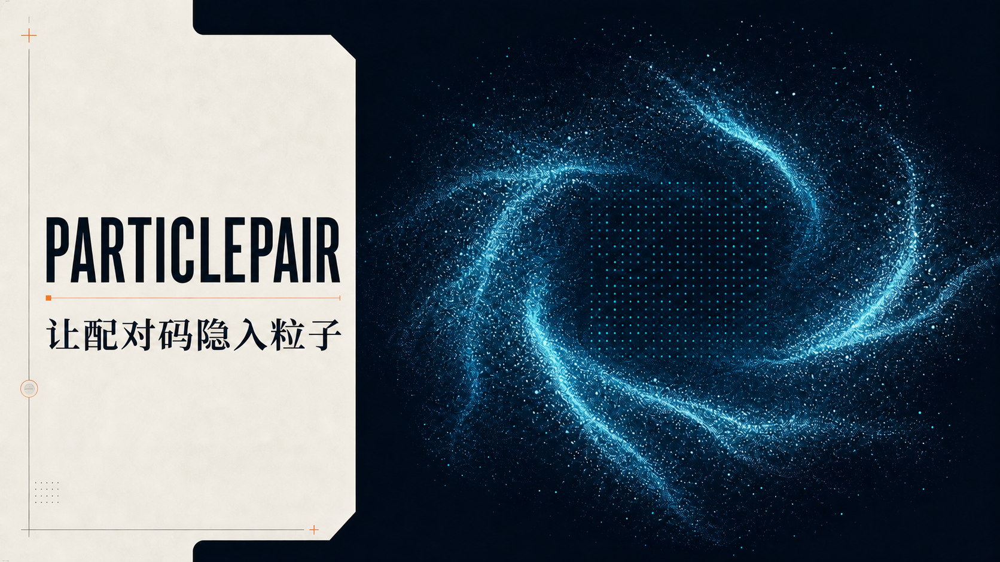

<div align="center">
  
  <h1>ParticlePair</h1>
  <p><strong>人眼看到粒子云，机器读出配对结构。</strong></p>
  <p>面向屏幕与相机的实验性光学带外配对方案。</p>
  <p><a href="./README.md">English</a> · <strong>简体中文</strong></p>

  <p>
    <a href="https://github.com/tianrking/ParticlePair/actions/workflows/ci.yml"></a>
    <a href="#已知限制"></a>
    <a href="./LICENSE"></a>
    <a href="./LICENSE"></a>
    <a href="./COMMERCIAL-LICENSE.md"></a>
  </p>

  <p>
    <a href="https://nextjs.org/"></a>
    <a href="https://react.dev/"></a>
    <a href="https://www.typescriptlang.org/"></a>
    <a href="https://vite.dev/"></a>
    <a href="https://workers.cloudflare.com/"></a>
    <a href="https://nodejs.org/"></a>
  </p>

  <p>
    <a href="https://vercel.com/new/clone?repository-url=https%3A%2F%2Fgithub.com%2Ftianrking%2FParticlePair&amp;project-name=particle-pair&amp;repository-name=particle-pair"></a>
  </p>
</div>



> [!IMPORTANT]
> ParticlePair 是**源码可用项目**，不是 OSI 定义的开源软件。一键部署按钮不会授予商业权利；商业产品、付费服务、SDK、硬件及其他商业用途必须取得单独书面授权。

## 项目简介

ParticlePair 将 128 位一次性配对秘密编码进动态粒子云。接收端通过相机比较两个相反调制相位，提取机器可读网格，纠正有限的比特错误，并且只在完整性校验通过后释放秘密。

它试图让人看到的是具有氛围感的粒子运动，而软件看到的是可以解码的结构。项目是独立设计的研究原型，不兼容、不隶属于 Apple Watch，也不是对 Apple 私有配对协议的逆向实现。

**快速导航：** [工作原理](#工作原理) · [快速开始](#快速开始) · [局域网访问](#局域网访问) · [一键部署](#部署) · [协议](#particle-code-v1) · [安全模型](#安全模型)

## 技术标签


| 层级 | 当前实现 |
| --- | --- |
| 配对材料 | 浏览器生成的 128 位一次性秘密 |
| 数据包 | 21 字节，包含头部与 CRC-16 |
| 纠错 | Hamming(12,8)，每个码字可纠正一位错误 |
| 光学布局 | 252 个编码位映射到 18×18 网格 |
| 调制 | 相反亮度相位，每相位 300 ms |
| 渲染 | Canvas 2D 动态粒子云 |
| 接收 | `getUserMedia()`、帧差分与同步相关检测 |
| 部署 | Cloudflare Worker/Sites 与 Vercel 原生 Next.js |

## 重要声明

- 本仓库尚未接受生产级密码学、硬件安全或独立安全审计。
- 自动化测试覆盖协议封装、纠错、CRC 拒绝、页面渲染与两条部署构建；它们不能证明大规模真实设备矩阵上的物理链路可靠性。
- 当前扫描器会搜索邻近裁剪比例与偏移，并恢复旋转或镜像输入；但仍需要按取景框对准，尚无自动角点检测、透视校正或设备标定。
- 仅允许 [PolyForm Noncommercial License 1.0.0](./LICENSE) 覆盖的用途；其他用途参见[商业授权说明](./COMMERCIAL-LICENSE.md)。

## 工作原理

```text
128 位一次性秘密
          │
          ▼  协议帧 + CRC-16
          │
          ▼  Hamming(12,8) 纠错
          │
          ▼  252 位映射到 18×18 网格
          │
          ▼  粒子云中的相反亮度相位
          │
          ▼  相机连续帧差分
          │
          └─ 同步 → 解码 → 纠错 → CRC 校验 → 释放秘密
```

人眼主要看到持续旋转、呼吸、聚集与散开的粒子云。机器将两个相反相位的画面相减，以抵消静态场景和大部分整体曝光偏移；非对称外圈用于判断差分符号，内部单元承载编码数据。

## 已实现能力

- 生成或输入 16 字节/128 位一次性秘密。
- 编码 21 字节 Particle Code v1 数据包。
- 通过 CRC-16/CCITT-FALSE 完成完整性检查。
- 对每个 Hamming(12,8) 码字纠正一位错误。
- 将 18×18 光学网格渲染成 Canvas 2D 动态粒子云。
- 通过浏览器相机执行带时间戳的视频帧配对、多比例裁剪搜索、旋转/镜像恢复、软证据累积、曝光漂移抵消和同步相关检测。
- 生成确定性的相反相位 PNG，执行不依赖离屏动画调度的 Canvas 像素闭环测试。
- 在独立码字中注入错误并运行本机闭环测试。
- 同时支持 Cloudflare Worker/Sites 与 Vercel 原生 Next.js 构建。

## 快速开始

### 环境要求

- Node.js 22.13 或更高版本
- npm
- 支持 Canvas、Web Crypto 和 `getUserMedia()` 的现代浏览器

### 浏览器兼容性

- 发送端可运行在当前桌面或移动版 Chrome、Edge、Firefox 和 Safari，只需支持 Canvas 2D 与 Web Crypto。
- 相机接收端还需要 HTTPS 安全上下文和 `getUserMedia()` 权限。iPhone Chrome/Safari、Android Chrome 以及当前桌面浏览器均通过能力检测适配，不依赖浏览器名称判断。
- 扫描器在可用时使用 `requestVideoFrameCallback()`，不可用时会自动回退到 `requestAnimationFrame()`。
- 请使用完整浏览器 App，不要使用微信等应用内置浏览器；扫描时让网页保持在前台。

```bash
git clone https://github.com/tianrking/ParticlePair.git
cd ParticlePair
npm ci
npm run dev
```

打开终端显示的本地地址。

### 本机闭环测试

1. 点击“生成新秘密”。
2. 点击“闭环自检”。
3. 测试会在三个独立 Hamming 码字中各翻转一位。
4. 解码器必须纠正错误、通过 CRC 校验并还原原始秘密。

## 局域网访问

让同一可信局域网内的手机或其他设备访问开发服务器：

```bash
npm run dev:lan
```

在另一台设备上打开终端显示的网络地址，通常是：

```text
http://<电脑局域网IP>:3000
```

- 两台设备必须连接同一个 Wi-Fi/局域网。
- Windows 弹出防火墙提示时，仅允许 Node.js 通过**专用网络**。
- 访客 Wi-Fi 或 AP isolation/客户端隔离可能阻止设备互访。
- 不要把开发服务器直接暴露到公网。

> [!WARNING]
> 普通 LAN HTTP 足以浏览页面、生成并**显示**粒子码；摄像头扫描依赖 `getUserMedia()`，浏览器通常要求 HTTPS 或 `localhost`。完整双设备扫描可让接收端打开 Vercel 等 HTTPS 部署，或者为局域网服务器配置被接收设备信任的 TLS。

## 部署

### Vercel 一键部署

[](https://vercel.com/new/clone?repository-url=https%3A%2F%2Fgithub.com%2Ftianrking%2FParticlePair&project-name=particle-pair&repository-name=particle-pair)

部署不需要环境变量、数据库或对象存储。[`vercel.json`](./vercel.json) 会选择原生 Next.js 构建，同时保留现有 Vinext/Cloudflare 构建链。

一键部署仍受本仓库许可证约束，**不会**自动授予商业使用权。

## 双设备相机扫描

1. 在发送设备上打开 ParticlePair，并保持完整粒子云可见。
2. 生成秘密，建议把调制强度提高到约 80% 或更高。
3. 在带相机的接收设备上打开 HTTPS ParticlePair 部署。
4. 点击“打开摄像头扫描”并授予相机权限。
5. 将发送端粒子云完整对准接收框。
6. 保持距离、角度和曝光稳定，等待同步与 CRC 校验完成。

`SYNC` 表示扣除随机相关底线后的同步证据，不是普通的相机活动进度。无关画面应保持在 0% 附近；超过 30% 才作为同步候选，达到 47% 才可进入多帧解码。只有数据包同时通过 Hamming 解码和 CRC-16 校验，界面才会显示“识别成功”。

屏幕刷新率、PWM、相机滚动快门、自动曝光和浏览器后台节流都会影响结果。当前实现是可运行的研究原型，不承诺免标定跨设备兼容。

## Particle Code v1

ParticlePair 是项目名称，**Particle Code v1** 是当前承载数据的光学帧协议。

### 数据包

```text
21 字节数据包
├── magic          1 字节   0xA7
├── version        1 字节   0x01
├── secret length  1 字节   0x10
├── pairing secret 16 字节
└── CRC-16         2 字节

21 字节 × Hamming(12,8) = 252 个光学位
```

### 光学布局

- 总网格：18×18，共 324 个单元。
- 外边界：68 个相位与帧同步单元。
- 内部区域：16×16，共 256 个单元。
- 有效编码：252 位。
- 剩余单元：4 位确定性填充。

非对称外圈让接收端能够判断差分相位符号，并搜索四种旋转方向和镜像输入。

### 纠错能力

每个原始字节独立编码为一个 Hamming(12,8) 码字，每个码字可修复一位翻转。CRC-16 用于检测并拒绝解码后的校验和不匹配；它既不能保证发现所有损坏，也不是密码学认证码。

## 安全模型

| 边界 | 当前状态 |
| --- | --- |
| 秘密材料 | 浏览器 Web Crypto 生成 128 位随机值 |
| 光学传输 | 差分调制，带有限纠错和 CRC |
| 数据加密 | 不提供 |
| 防重放 | 演示中没有到期时间或已用秘密存储 |
| 设备认证 | 光学秘密只为后续认证协议提供材料 |
| 后续链路 | 生产系统必须另行实现经过审计的认证密钥交换 |
| 安全审计 | 未完成 |

生产设计还需要加入有效期、会话绑定、一次性消费、重放检测，采用 SPAKE2、带认证的 X25519 或其他经过审查的握手方案，将长期私钥放入安全存储，并完成解析器模糊测试和独立审计。漏洞报告方式见 [SECURITY.md](./SECURITY.md)。

## 验证

```bash
npm run lint
npx tsc --noEmit
npm test
npm run build:vercel
```

`npm test` 覆盖干净往返解码、独立 Hamming 码字纠错、超出预算后的 CRC 拒绝、Cloudflare/Sites 生产构建以及服务端产品页面渲染检查。最后一条命令验证 Vercel 使用的原生 Next.js 构建路径。

## 已知限制

- 尚无自动边界检测或透视校正。
- 比例与偏移搜索范围有限，完整粒子码仍必须处于取景框内。
- 没有屏幕色域、相机白平衡或刷新率自动标定。
- 装饰粒子运动仍会向差分信号引入噪声。
- Hamming 每个码字只能纠正一位错误。
- 未实现时间戳、会话绑定、已用秘密状态或防重放。
- 极端滚动快门、PWM 或曝光变化仍可能超过纠错预算。
- 实验协议不承诺向后兼容。
- 尚无公开、可复现的跨设备成功率数据集。

## 路线图

- [ ] 自动角点检测与透视校正
- [x] 旋转和镜像恢复
- [ ] 屏幕/相机标定流程
- [ ] 软判决解码与更强的擦除码
- [ ] 时间戳、nonce、会话绑定和防重放状态
- [ ] Android CameraX 原生接收器
- [ ] BLE/Wi-Fi 认证握手参考集成
- [ ] 可复现的多设备基准测试套件
- [ ] 独立安全审计

## 项目结构

```text
app/          页面、元数据与全局视觉样式
components/   粒子发送端、相机扫描器与实验界面
lib/          CRC、Hamming、协议封装和光学布局
tests/        协议与渲染输出验证
worker/       Cloudflare Worker/Sites 入口
public/       社交分享图与静态资源
```

## 贡献

兼容性测试、研究资料、问题报告与可复现测量数据都有价值。由于项目可能提供单独商业授权，在签署适当贡献协议前不会自动接受代码贡献。提交前请阅读 [CONTRIBUTING.md](./CONTRIBUTING.md)。

## 许可证与商业使用

Copyright © 2026 tianrking。

代码依据 [PolyForm Noncommercial License 1.0.0](./LICENSE) 提供。它允许许可条款覆盖的非商业研究、学习、实验、修改与再分发，但不授予商业产品、付费服务、商业硬件、商业 SDK 或其他商业活动中的使用权。

必须保留 [NOTICE](./NOTICE)。商业授权参见 [COMMERCIAL-LICENSE.md](./COMMERCIAL-LICENSE.md)。如果本摘要与许可证正文存在差异，以许可证正文为准。

## 研究参考

ParticlePair 为独立设计，以下屏幕—相机通信项目提供了重要研究背景：

- [HiLight — Real-Time Screen-Camera Communication Behind Any Scene](https://dartnets.cs.dartmouth.edu/hilight)
- [ChromaCode — A Fully Imperceptible Screen-Camera Communication System](https://walleve.github.io/ChromaCode/)
- [libcimbar — Color Icon Matrix Barcodes](https://github.com/sz3/libcimbar)
- [TXQR — Transfer data via animated QR codes](https://github.com/divan/txqr)

这些项目仅作为研究背景。ParticlePair 不复制它们的协议格式，也不声称兼容任何商业设备的私有配对协议。
